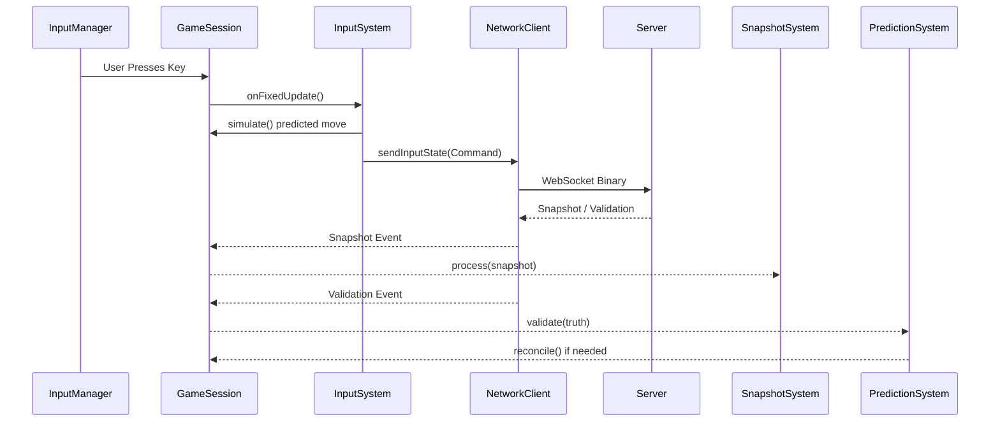

# Function and Data Flow

This document details how data moves through the systems and the sequence of function calls during a typical game session.

## 1. Function Flow (Call Stack Sequence)

### Initialization Sequence
1. **React Mount**: `page.js` initializes objects.
2. **GameSession Constructor**: 
   - Sets up Event Bus, Network Client, and Input Manager.
   - Instantiates `SnapshotSystem`, `InputSystem`, and `PredictionSystem`.
3. **Scene Initialization**:
   - `Scene` signals `GameSession` via `"scene:initialized"` event.
   - `GameSession` fills model pools (Durgs, Zurgs, Guns) and connects to the server.

### The Update Loop (Per Frame/Tick)
1. **`GameSession.update()`**: Called by the renderer.
   - Calculates `deltaTime`.
   - **Fixed Tick Loop**: Executes `onFixedUpdate` every 50ms (20Hz).
     - **`InputSystem.update()`**:
       - Samples `InputManager`.
       - `simulate()` movement (CSP).
       - `NetworkClient.sendInputState()` to server.
3. **`InterpolationSystem.update()`**: Smoothing.
   - Using alpha (fixedTickAccumulator / fixedTickRate) to transition between the last known positions.
4. **Variable Frame Update**: 
   - `onUpdate(deltaTime)` for non-fixed logic.

## 2. Data Flow

### Inbound Data (Server → Client)
- **Pathway**: Server Binary -> `NetworkClient` -> `snapshot` event -> `GameSession` -> `SnapshotSystem`.
- **Logic**:
  - `SnapshotSystem.processPlayers()` updates local player meshes.
  - `SnapshotSystem.processZurgs()` handles zombie animations/positioning.
  - `SnapshotSystem.processWindows()` updates environmental destruction/repair states.

### Outbound Data (Client → Server)
- **Pathway**: `InputManager` -> `InputSystem` -> `NetworkClient` -> Server.
- **Logic**:
  - Raw inputs (W,A,S,D) and current rotation are bundled into an `InputCommand`.
  - The local `clientTick` and `commandNumber` are attached for tracking.

### Feedback Loop (Prediction Validation)
- **Pathway**: Server Truth -> `NetworkClient` -> `INPUT_VALIDATE` event -> `GameSession` -> `PredictionSystem`.
- **Logic**:
  - Client looks up the command in `inputBuffer` using the `commandNumber`.
  - If mismatch: `PredictionSystem.reconcile()` overwrites the past state and re-simulates all pending commands to "catch up" the player to the present.

## 3. Communication Diagram

