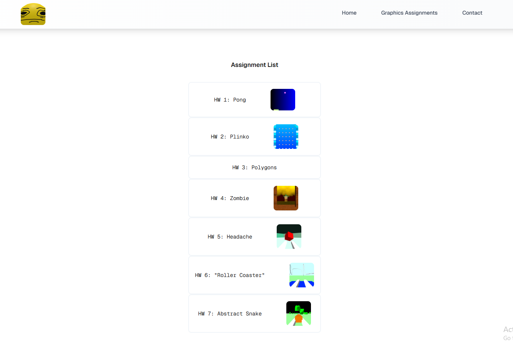

# Computer Graphics Fall 2025 Portfolio

     
    <em>Site containing all my fragment shader and vertex shader assignments using only WebGL and built in JavaScript libraries</em>

## [Live Demo](https://cims.nyu.edu/~ncr7500/graphics/)

    <image src="models/plinko_demo.gif" alt="Plinko Demo" width="400">

## To compile
To build this project locally, follow these instructions:
1. Clone a copy of this repo on your local machine or download and extract the zip folder from this repo.
2. Change directory into the folder `wordle\portfolio` and open a terminal.
3. Install the dependencies using `npm install`
4. Run the project in development mode using `npm run dev`
5. Click on the link in the terminal or travel to `http://localhost:300`
6. To build the project in an out folder, use `npm run build`

## Assignment List
- `Week 1`: [Pong](https://cims.nyu.edu/~ncr7500/graphics/hw1/)
- `Week 2`: [Plinko](https://cims.nyu.edu/~ncr7500/graphics/hw2/)
- `Week 3`: [Polygons](https://cims.nyu.edu/~ncr7500/graphics/hw3/)
- `Week 4`: [Zombie](https://cims.nyu.edu/~ncr7500/graphics/hw4/)
- `Week 5`: [Headache](https://cims.nyu.edu/~ncr7500/graphics/hw5/)
- `Week 6`: ["Rollercoaster"](https://cims.nyu.edu/~ncr7500/graphics/hw6/)
- `Week 7`: [Abstract Snake](https://cims.nyu.edu/~ncr7500/graphics/hw7/)